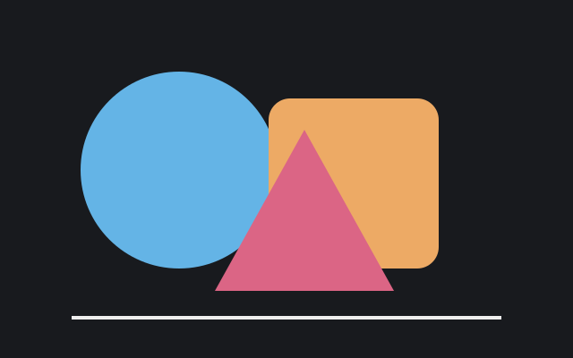

# A visual pager

Gloss renders **Markdown with Glamour**, including local raster images and SVGs.
Use `j` / `k` to scroll and `s` to toggle source. Press `m` for the file menu.

## An embedded SVG



## A small table

| Input | Rendering |
| --- | --- |
| Markdown | Glamour |
| SVG | NTCharts SVG |
| STL | NTCharts3d |

```sh
gloss --preview examples/readme.md examples/shapes.svg examples/tetrahedron.stl
```

Remote images are shown as placeholders; local paths resolve beside this file.
